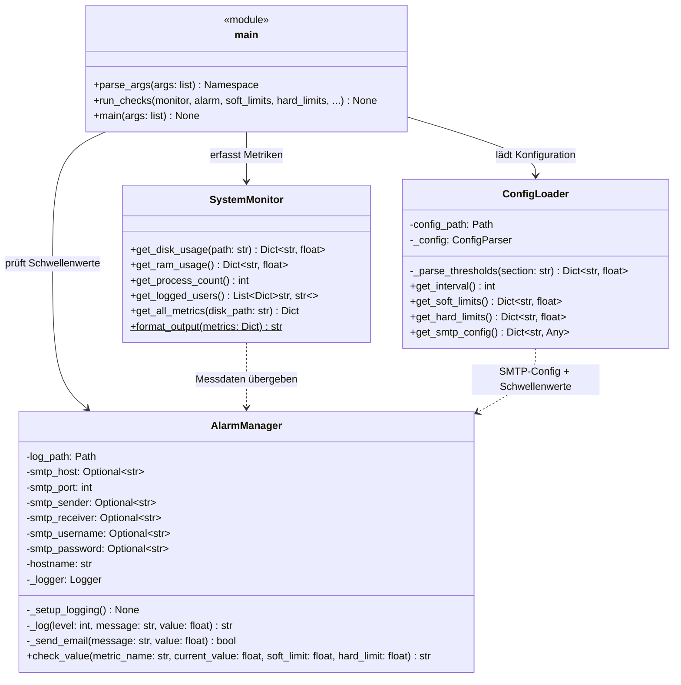

# Klassendiagramm: LF8 Monitoring System

## Übersicht

Das folgende Diagramm zeigt die Architektur der Software mit allen Klassen,
ihren Attributen, Methoden und Beziehungen.

## Diagramm

## Beziehungen

| Beziehung | Beschreibung |
|-----------|-------------|
| `main` → `ConfigLoader` | Lädt Schwellenwerte und SMTP-Konfiguration aus config.ini |
| `main` → `SystemMonitor` | Erfasst Systemmetriken (Disk, RAM, Prozesse, User) |
| `main` → `AlarmManager` | Prüft Messwerte gegen Soft-/Hardlimits |
| `SystemMonitor` ⇢ `AlarmManager` | Messdaten werden an check_value() übergeben |
| `ConfigLoader` ⇢ `AlarmManager` | SMTP-Credentials und Schwellenwerte konfigurieren den AlarmManager |
