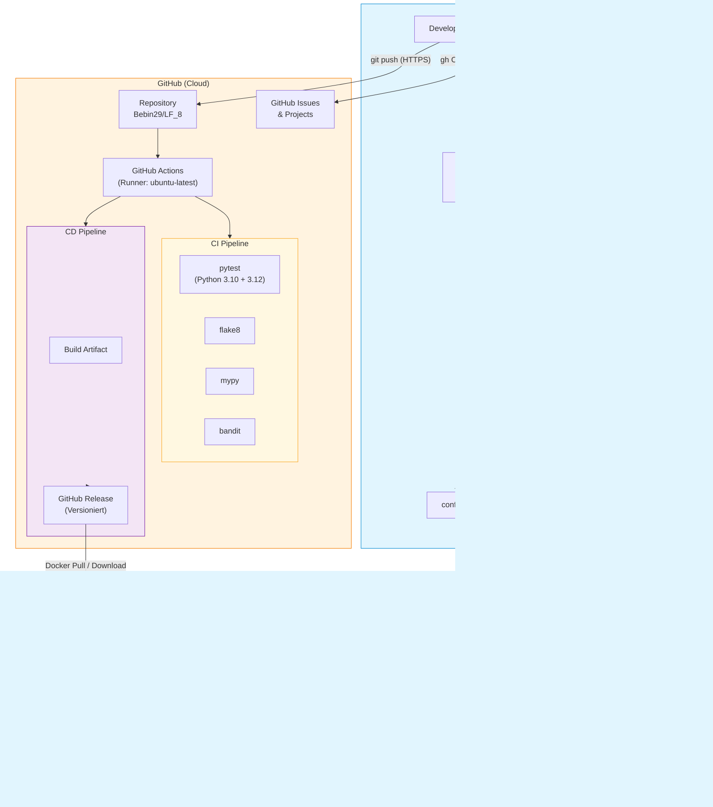

# Verteildiagramm: LF8 Monitoring System

## Übersicht

Das folgende Diagramm zeigt die Verteilung der Software-Komponenten
auf die verschiedenen Umgebungen und deren Kommunikation.

## Diagramm

## Komponenten und Kommunikation

### Lokale Entwicklungsumgebung
Die Entwicklung findet auf lokalen Workstations statt. Python 3.10+ mit einem
Virtual Environment stellt alle Abhängigkeiten bereit. Der Quellcode liegt in
`src/`, die Konfiguration in `config.ini` und sensible SMTP-Credentials in `.env`.
Optional kann die Anwendung lokal auch als Docker-Container gestartet werden.

### GitHub (Cloud)
Das Repository auf GitHub dient als zentraler Punkt für Versionsverwaltung,
Issue-Tracking und automatisierte Pipelines. Bei jedem Push oder Pull Request
werden die CI-Jobs (pytest, flake8, mypy, bandit) auf GitHub Actions Runnern
(ubuntu-latest) ausgeführt. Bei einem Merge auf `main` erstellt die CD-Pipeline
automatisch ein versioniertes GitHub Release mit Build-Artefakt.

### Produktivumgebung
Die Software wird als Docker-Container (basierend auf python:3.12-slim)
bereitgestellt. Der Container führt das Monitoring im Intervall-Modus aus
und schreibt Alarme in eine Logdatei.

### Externe Dienste
Bei Hardlimit-Überschreitungen wird eine E-Mail über einen externen SMTP-Server
versendet. Die Kommunikation erfolgt über Port 587 mit TLS-Verschlüsselung.

## Protokolle

| Verbindung | Protokoll | Port |
|------------|-----------|------|
| Developer → GitHub | HTTPS (Git + API) | 443 |
| GitHub Actions → Runner | HTTPS | 443 |
| Monitoring → SMTP Server | SMTP + TLS | 587 |
| Developer → Docker Hub | HTTPS | 443 |
