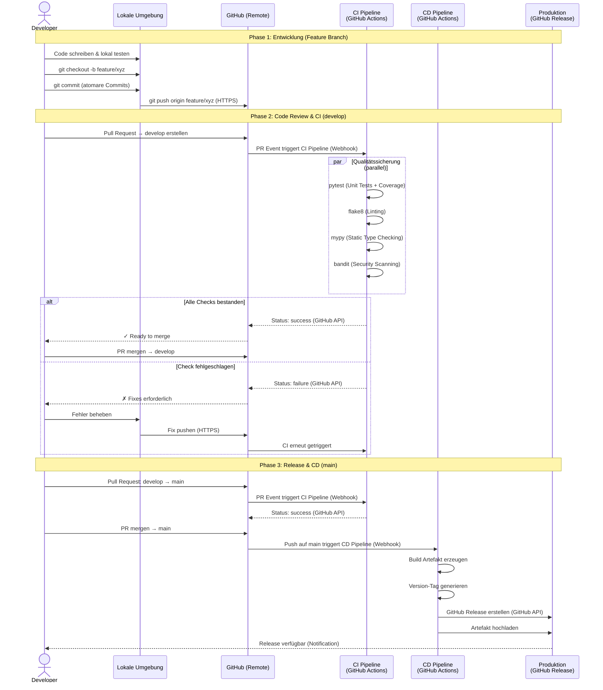

# Sequenzdiagramm: CI/CD Pipeline

## Übersicht

Das folgende Diagramm zeigt den vollständigen Software Development Life Cycle (SDLC)
von der lokalen Entwicklung bis zum Deployment in die Produktivumgebung.

## Diagramm

## Verwendete Protokolle

| Protokoll | Verwendung |
|-----------|------------|
| **HTTPS** | Git Push/Pull zwischen lokaler Umgebung und GitHub |
| **GitHub API (REST)** | Status Checks, Release-Erstellung, Artefakt-Upload |
| **Webhooks (HTTPS)** | GitHub triggert Actions-Workflows bei Push/PR Events |
| **SMTP** | Benachrichtigungen bei Release (GitHub Notifications) |

## QA-Maßnahmen im Detail

| Maßnahme | Tool | Zweck |
|----------|------|-------|
| Unit Tests | pytest + pytest-cov | Funktionale Korrektheit, Testabdeckung |
| Linting | flake8 | Code-Stil, PEP 8 Konformität |
| Type Checking | mypy | Statische Typprüfung, Fehler vor Laufzeit erkennen |
| Security Scan | bandit | Sicherheitslücken im Python-Code erkennen |
| Code Review | Pull Requests | Manuelle Prüfung durch Entwickler |
| Branch Protection | GitHub Rules | Erzwingt CI-Checks und PR-Reviews vor Merge |
